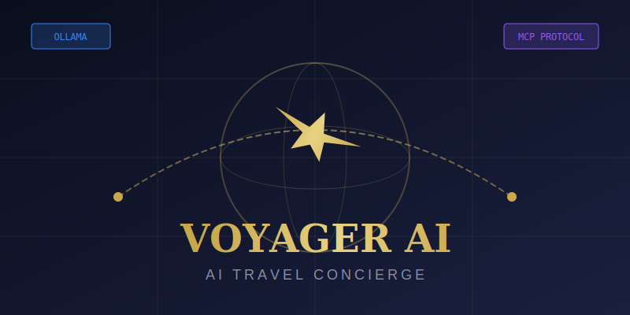

# ✈️ Voyager AI - Travel Agent Demo

> **An AI Travel Concierge Demo powered by Ollama (qwen3:8b) with MCP Protocol Visualization**

[](https://opensource.org/licenses/MIT)
[](https://nodejs.org/)
[](https://ollama.ai)
[](https://modelcontextprotocol.io/)




## 🌟 Overview

Voyager AI is a production-quality demo application showcasing an AI travel concierge with real-time MCP (Model Context Protocol) tool visualization. Built with React, Express, and Ollama, it demonstrates how AI agents can use tools to plan complete travel experiences.

### Key Features

- 🤖 **AI Travel Agent** - Intelligent concierge powered by Ollama (qwen3:8b)
- 🔧 **7 MCP Tools** - Flights, hotels, weather, activities, itineraries, visas, currency
- 📊 **Live Debugger** - Real-time MCP protocol visualization
- 🎨 **Premium UI** - Dark luxurious travel-brand aesthetic
- ⚡ **Agentic Loop** - Multi-step tool calling with up to 8 iterations
- 🔌 **WebSocket** - Real-time log streaming


## 🚀 Quick Start

### Prerequisites

- **Node.js 18+** - [Download](https://nodejs.org/)
- **Ollama** - [Install](https://ollama.ai/)

### Installation

```bash
# Clone the repository
git clone https://github.com/Grajesh-Chandra/mcp-travel-agent.git
cd mcp-travel-agent

# Install dependencies
npm install

# Pull the required Ollama model
ollama pull qwen3:8b

# Start the application
npm run start
```

### Manual Start

```bash
# Terminal 1: Start Ollama (if not running)
ollama serve

# Terminal 2: Start the application
npm run dev
```

The application will be available at:
- **Frontend**: http://localhost:3000
- **Backend API**: http://localhost:3001
- **WebSocket**: ws://localhost:3001/ws


## 📁 Project Structure

```
mcp-travel-agent/
├── server/                   # Express backend
│   ├── index.js             # Main server with WebSocket
│   ├── logger.js            # Winston logging utility
│   ├── mcpProtocol.js       # MCP protocol handler
│   ├── mcpTools.js          # 7 mock MCP tools
│   └── ollamaService.js     # Ollama API integration
├── src/                     # React frontend
│   ├── components/          # UI components
│   │   ├── App.jsx          # Main application
│   │   ├── ChatPanel.jsx    # Chat interface
│   │   ├── DebuggerPanel.jsx # MCP debugger
│   │   ├── ToolRegistry.jsx  # Tool schema viewer
│   │   ├── SessionStats.jsx  # Live statistics
│   │   └── ...              # Other components
│   ├── hooks/               # React hooks
│   │   ├── useWebSocket.js  # WebSocket connection
│   │   └── useChat.js       # Chat state management
│   └── utils/               # Utilities
│       ├── api.js           # API client
│       └── helpers.js       # Helper functions
├── scripts/                 # Shell scripts
│   ├── startup.sh           # Start the application
│   ├── cleanup.sh           # Stop and cleanup
│   └── check-prereqs.sh     # Check prerequisites
├── logs/                    # Log files (auto-generated)
├── public/                  # Static assets
└── package.json
```


## 🔧 MCP Tools

The demo includes 7 mock MCP tools that simulate travel services:

| Tool | Description | Input |
|------|-------------|-------|
| `search_flights` | Search for available flights | origin, destination, date, passengers, cabin_class |
| `search_hotels` | Search for hotels | city, check_in, check_out, guests, star_rating |
| `get_weather_forecast` | Get weather forecast | city, start_date, end_date |
| `search_activities` | Find activities/experiences | city, date, category, budget |
| `create_itinerary` | Create complete itinerary | traveler_name, destination, flight/hotel/activity IDs |
| `get_visa_requirements` | Check visa requirements | destination_country, passport_country |
| `currency_exchange` | Convert currencies | from_currency, to_currency, amount |

Each tool simulates 400-1000ms delay for realistic demo behavior.


## 🖥️ Architecture

### Three-Panel Layout

```
┌─────────────────────────────────┬──────────────────────────────┐
│                                 │                              │
│     CHAT PANEL (55%)            │    MCP DEBUGGER (45%)        │
│                                 │                              │
│  ┌─────────────────────────┐    │  ┌──────────────────────┐   │
│  │ ✈ VOYAGER AI            │    │  │ Live Logs            │   │
│  │ Your Travel Concierge   │    │  │ Request/Response     │   │
│  └─────────────────────────┘    │  │ Tool Registry        │   │
│                                 │  │ Session Stats        │   │
│  User/Assistant Messages        │  └──────────────────────┘   │
│  with inline tool cards         │                              │
│                                 │  Real-time MCP protocol      │
│  ┌─────────────────────────┐    │  visualization with JSON     │
│  │ Quick Prompt Chips      │    │  syntax highlighting         │
│  └─────────────────────────┘    │                              │
│                                 │                              │
└─────────────────────────────────┴──────────────────────────────┘
```

### Agentic Loop

1. User sends message
2. Server sends to Ollama with tool definitions
3. If Ollama returns `tool_use`, execute mock tool
4. Log MCP request/response to WebSocket
5. Return tool result to Ollama
6. Repeat until `end_turn` (max 8 iterations)
7. Stream final response to client


## 🎨 Design System

### Colors

| Name | Hex | Usage |
|------|-----|-------|
| Navy 900 | `#0a0f1e` | Background |
| Gold 500 | `#c9a84c` | Accents, highlights |
| Purple | `#8b5cf6` | SYSTEM logs |
| Blue | `#3b82f6` | REQUEST logs |
| Yellow | `#eab308` | TOOL_CALL logs |
| Green | `#22c55e` | TOOL_RESULT logs |
| Red | `#ef4444` | ERROR logs |

### Typography

- **Headings**: Playfair Display
- **Body**: DM Sans
- **Code**: JetBrains Mono


## 📜 Scripts

```bash
# Start development servers (frontend + backend)
npm run dev

# Start with the startup script (recommended)
npm run start

# Stop all servers
npm run stop

# Build for production
npm run build

# View server logs
npm run logs

# Check prerequisites
bash scripts/check-prereqs.sh
```


## 🔌 API Endpoints

| Method | Endpoint | Description |
|--------|----------|-------------|
| GET | `/api/health` | Server health check |
| POST | `/api/mcp/init` | Initialize MCP session |
| GET | `/api/mcp/handshake` | Get MCP handshake sequence |
| GET | `/api/tools` | List all registered tools |
| GET | `/api/tools/stats` | Get tool usage statistics |
| POST | `/api/chat` | Send chat message |
| GET | `/api/stats` | Get session statistics |
| POST | `/api/session/reset` | Reset session |


## 🔒 Environment Variables

| Variable | Default | Description |
|----------|---------|-------------|
| `PORT` | `3001` | Backend server port |
| `OLLAMA_URL` | `http://localhost:11434` | Ollama API URL |
| `OLLAMA_MODEL` | `qwen3:8b` | Ollama model to use |
| `LOG_LEVEL` | `debug` | Logging level |
| `NODE_ENV` | `development` | Environment |


## 🐛 Troubleshooting

### Ollama not responding

```bash
# Start Ollama server
ollama serve

# Pull the required model
ollama pull qwen3:8b

# Verify model is available
ollama list
```

### Port already in use

```bash
# Kill processes on ports 3000 and 3001
lsof -ti:3000,3001 | xargs kill -9

# Or use the cleanup script
npm run stop
```

### WebSocket connection failed

The WebSocket connects to `ws://localhost:3001/ws`. Ensure the backend server is running and no firewall is blocking the connection.


## 📄 License

MIT License - see [LICENSE](LICENSE) for details.


## 🤝 Contributing

1. Fork the repository
2. Create a feature branch
3. Make your changes
4. Submit a pull request


## 👨‍💻 Author

**Grajesh Chandra**


## 🙏 Acknowledgments

- [Ollama](https://ollama.ai) - Local LLM runtime
- [Anthropic MCP](https://modelcontextprotocol.io/) - Model Context Protocol
- [React](https://react.dev) - UI framework
- [Tailwind CSS](https://tailwindcss.com) - Styling
- [Express](https://expressjs.com) - Backend framework
